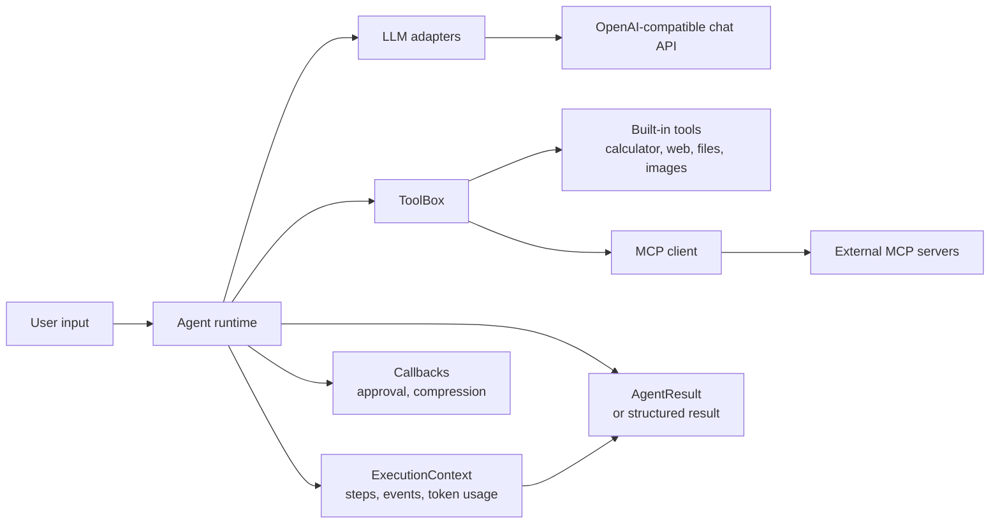
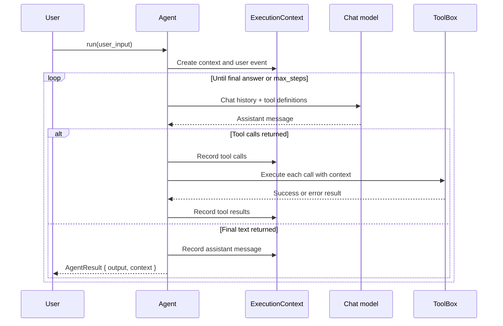
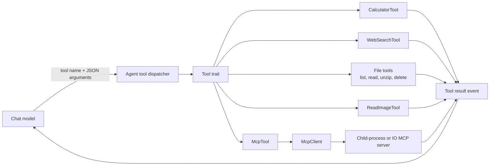
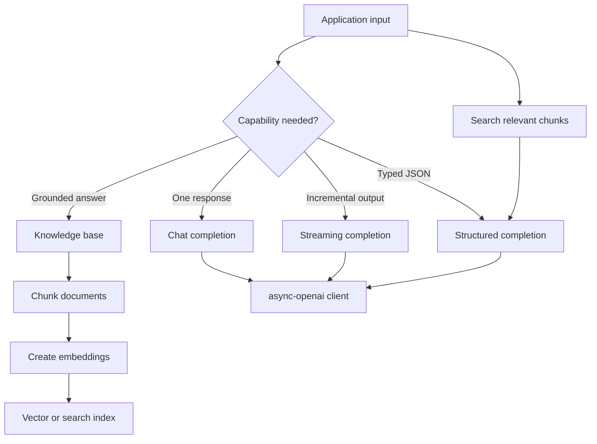

# Rust AI Agent

An async, library-first playground for building tool-using AI agents in Rust.
The original repository accompanies the Bilibili series [Building AI Agents with Rust](https://space.bilibili.com/361469957). This branch is a personal workspace for understanding the design and experimenting with it.

## Design At A Glance

The crate separates orchestration from capabilities. The agent runtime owns the conversation loop and execution state; LLM adapters translate requests and responses; tools provide actions; callbacks and retrieval add cross-cutting behavior.



## Repository Map

```mermaid
flowchart TB
	Root[ai-agent crate]

	Root --> Runtime[src/agent]
	Runtime --> RuntimeCore[runtime.rs\nAgent and run loops]
	Runtime --> Context[context.rs\nExecutionContext and TokenUsage]
	Runtime --> Events[event.rs\nmessages, tool calls, results]
	Runtime --> AgentCallbacks[callback.rs\nagent callback surface]

	Root --> LLM[src/llm]
	LLM --> Complete[complete.rs]
	LLM --> Stream[stream.rs]
	LLM --> Structured[structured.rs and structured_ds.rs]
	LLM --> Semaphore[semaphore.rs\nconcurrency control]

	Root --> ToolLayer[src/tools]
	ToolLayer --> ToolContract[tool.rs\nTool trait]
	ToolLayer --> BuiltinTools[calculator, web_search,\nfile explorer, read_image]
	ToolLayer --> MCPTools[mcp/client.rs and tool.rs]

	Root --> Retrieval[src/knowledge_base]
	Retrieval --> Chunk[chunk.rs]
	Retrieval --> Embed[embed.rs]
	Retrieval --> Search[search.rs]

	Root --> CrossCutting[src/callback]
	CrossCutting --> Approval[approval.rs]
	CrossCutting --> Compressor[search_compressor.rs]

	Root --> Examples[examples/]
	Root --> Binaries[src/bin/]
```



### Main responsibilities

| Area | Responsibility | Important types or files |
| --- | --- | --- |
| Agent runtime | Orchestrates model calls, tool calls, retries, step limits, and final results | `Agent`, `AgentResult`, `src/agent/runtime.rs` |
| Execution state | Keeps the event history and cumulative token usage for one run | `ExecutionContext`, `Event`, `src/agent/context.rs` |
| LLM layer | Offers normal, streaming, structured, and semaphore-limited model calls | `src/llm/` |
| Tool layer | Describes and executes capabilities behind one async trait | `Tool`, `ToolBox`, `src/tools/tool.rs` |
| MCP integration | Discovers tools from an MCP server and exposes them as local tools | `McpClient`, `McpTool`, `src/tools/mcp/` |
| Knowledge base | Chunks content, creates embeddings, and searches indexed material | `src/knowledge_base/` |
| Callbacks | Adds approval and search-result compression behavior around execution | `src/callback/` |

## Agent Execution Flow

The normal `run` path repeatedly asks the model whether it can answer or needs a tool. Every tool call and result is recorded in the execution context, then converted back into messages for the next model request.



Two safeguards are part of the runtime design:

- `max_steps` prevents an agent from looping forever.
- Model requests are retried with exponential backoff, while token usage is accumulated in `ExecutionContext`.

The `run_structured<T>` path uses the same loop but adds a generated `final_answer` tool. The model must call that tool with JSON matching `T`, which gives callers a typed result instead of unstructured text.

## Tool Architecture

Tools are intentionally small. A tool supplies a name and schema for the model, then implements execution against JSON arguments and the current `ExecutionContext`.



The built-in factories make two useful configurations:

```rust
let tools = ai_agent::tools::build_toolbox().await?;
let file_tools = ai_agent::tools::build_file_explorer_toolbox("vision-model");
```

`build_toolbox()` combines local calculator/web tools with tools discovered from the configured MCP client. `build_file_explorer_toolbox()` creates a local file-oriented toolbox without requiring MCP discovery.

## LLM and Retrieval Design



This is a capability layer, not a second agent runtime. The `Agent` loop uses the model and tools directly, while the standalone LLM functions are useful for simpler applications, streaming UIs, structured extraction, and retrieval experiments.

## Running the Examples

The examples are the best executable documentation for the public API:

```bash
cargo run --example simple_agent_loop
cargo run --example agent_run
cargo run --example stream_chat
cargo run --example structured_chat
cargo run --example file_explorer
cargo run --example search_web
```

The default binary demonstrates a structured completion:

```bash
cargo run
```

Model and MCP credentials are loaded by the application through environment variables and `.env` support. Keep secrets out of Git and check each example for the configuration it expects.

## Getting Started

```bash
git clone https://github.com/solenovex/rust-ai-agent.git
cd rust-ai-agent
git switch jiebi-playground
cargo check
```

The upstream tutorial uses episode tags such as `ep04`; those tags are useful when comparing the implementation with a particular lesson. This branch is intended for independent changes and design experiments.

## Development Notes

- Rust edition: 2024
- Runtime: Tokio
- Model API: `async-openai`
- Tool protocol: MCP through `rmcp`
- Serialization and schemas: Serde and Schemars
- Reliability: exponential retry for model calls and explicit agent step limits

The architecture is deliberately open for experimentation: new tools implement `Tool`, new model interaction styles belong under `src/llm`, and new execution-wide behavior can be expressed through the callback modules or additional event types.
